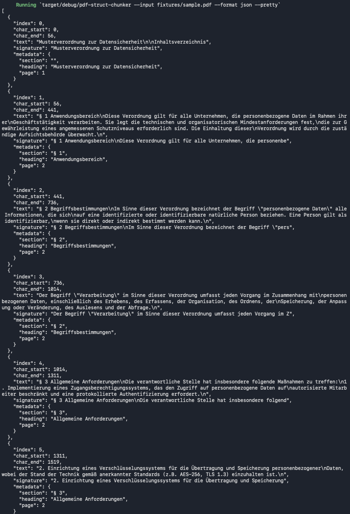

# pdf-struct-chunker

[](https://github.com/matthiasnordwig/pdf-struct-chunker/actions)
[](https://crates.io/crates/pdf-struct-chunker)
[](LICENSE)
[](https://www.rust-lang.org)

**Split PDFs into semantically meaningful chunks — without LLMs, without APIs, without cloud dependencies.**

> 🌐 **Author: Matthias Nordwig** · [programmiere.de](https://programmiere.de)



---

## The Problem

Most RAG chunkers blindly split documents by token count or character limit. This destroys document structure — headings, sections, and paragraphs get ripped apart. The result: your vector search returns incoherent fragments with no context about where they came from.

**pdf-struct-chunker** solves this by analyzing the actual *layout* of a PDF: X/Y coordinates, font sizes, and bold detection. It understands where a heading starts, where a paragraph ends, and where a new section begins. Each chunk carries structured metadata (`section`, `heading`, `page`) so your RAG pipeline knows exactly what it's looking at.

No LLM needed. No API calls. Runs offline. Written in pure Rust.

### Before & After

**❌ Standard RAG (Fixed-size overlap)**
```json
// Chunk 1
"This regulation applies to all companies. § 2 De-"

// Chunk 2
"finitions. In this regulation, the following terms"
```
*Result: Words are cut in half, headings are disconnected from their content.*

**✅ pdf-struct-chunker (Layout-aware)**
```json
// Chunk 1
{
  "metadata": { "section": "§ 1", "heading": "Scope" },
  "text": "This regulation applies to all companies."
}
// Chunk 2
{
  "metadata": { "section": "§ 2", "heading": "Definitions" },
  "text": "In this regulation, the following terms..."
}
```
*Result: Clean, semantic chunks with perfect metadata.*

---

## Performance / Benchmark

Built for speed and Edge-AI scenarios:
- **No GPU required** (pure CPU processing)
- **Extremely fast**: Processes a 100-page PDF in `< 1 second` on a standard laptop.
- **Low memory footprint**: Operates entirely in-memory without creating temporary files.

---

## Quick Start

A sample PDF is included — you can try it immediately after cloning:

```bash
git clone https://github.com/matthiasnordwig/pdf-struct-chunker.git
cd pdf-struct-chunker
cargo run --release -- -i fixtures/sample.pdf --format json --pretty
```

Output:

```json
[
  {
    "index": 0,
    "char_start": 0,
    "char_end": 441,
    "text": "§ 1 Anwendungsbereich\nDiese Verordnung gilt für alle Unternehmen ...",
    "signature": "§ 1 Anwendungsbereich\nDiese Verordnung gilt für alle Unternehmen",
    "metadata": {
      "section": "§ 1",
      "heading": "Anwendungsbereich",
      "page": 2
    }
  },
  {
    "index": 1,
    "text": "§ 2 Begriffsbestimmungen\nIm Sinne dieser Verordnung ...",
    "metadata": {
      "section": "§ 2",
      "heading": "Begriffsbestimmungen",
      "page": 2
    }
  }
]
```

Every chunk knows its section, heading, and page number — ready for embedding.

---

## How it Works

```
PDF bytes ──► pdf_oxide (extract characters with X/Y positions + font sizes)
                │
                ▼
          Line Classification
          (match lines against your regex profiles, or fall back to font-size heuristics)
                │
                ▼
          Chunk Assembly
          (split at headings, merge small fragments, split overflow at sentence boundaries)
                │
                ▼
          Vec<Chunk> { text, section, heading, page }
```

The chunker processes each PDF page by extracting character-level bounding boxes, reconstructing lines from Y-coordinates, classifying them using configurable regex patterns (or font-size heuristics as fallback), and assembling them into semantically coherent chunks with structural metadata.

---

## Installation

### From Source
```bash
git clone https://github.com/matthiasnordwig/pdf-struct-chunker.git
cd pdf-struct-chunker
cargo build --release
```

### As a Dependency in Your Rust Project

The easiest way is to add it from crates.io:
```bash
cargo add pdf-struct-chunker
```

Or add this to your `Cargo.toml`:
```toml
[dependencies]
pdf-struct-chunker = "0.1.0"
```

---

## CLI Usage

```bash
pdf-struct-chunker [OPTIONS] --input <INPUT>
```

| Flag | Description | Default |
|------|-------------|---------|
| `-i, --input <FILE>` | Path to the input PDF file | **Required** |
| `-p, --profile <FILE>` | Path to a JSON profile with custom regex rules (see below) | Built-in defaults |
| `-o, --output <FILE>` | Output file path | `stdout` |
| `--format <FORMAT>` | Output format: `jsonl` or `json` | `jsonl` |
| `--pretty` | Pretty-print JSON output | `false` |
| `--stats` | Print chunk statistics instead of the chunks themselves | `false` |

### Examples
```bash
# Chunk a PDF and save as JSONL
pdf-struct-chunker -i document.pdf -o result.jsonl

# Pretty-print JSON to the console
pdf-struct-chunker -i document.pdf --format json --pretty

# See how many chunks were created and their sizes
pdf-struct-chunker -i document.pdf --stats

# Use your own regex rules
pdf-struct-chunker -i document.pdf -p my_rules.json --format json --pretty
```

---

## Library API (In-Memory)

The core function operates entirely in-memory — no file I/O, no temp files. Feed it bytes from anywhere (file, HTTP upload, S3, database) and get chunks back instantly:

```rust
use pdf_struct_chunker::{chunk_pdf, Profile};

fn main() {
    let bytes = std::fs::read("document.pdf").unwrap();

    let chunks = chunk_pdf(&bytes, None).unwrap();

    for chunk in &chunks {
        println!("[{}] {} (p.{})",
            chunk.metadata.section,
            chunk.metadata.heading,
            chunk.metadata.page.unwrap_or(0),
        );
    }
}
```

---

## Custom Regex Profiles

By default, the chunker uses built-in heuristics optimized for legal and regulatory documents (detecting `§`, `Article`, `Chapter`, etc.). You can override this with your own regex rules.

Create a `.json` file (e.g., `my_rules.json`) and pass it via `--profile`:

```bash
pdf-struct-chunker -i document.pdf -p my_rules.json
```

### Simple Example — Ignore Page Numbers

The simplest profile just removes unwanted lines:

```json
{
  "patterns": [
    {
      "role": "ignore",
      "regex": "Page \\d+",
      "flags": "i",
      "priority": 100
    }
  ]
}
```

This removes every line matching "Page 1", "Page 2", etc. from the output.

### Full Example — Custom Headings and Definitions

```json
{
  "min_chunk_chars": 200,
  "max_chunk_chars": 1500,
  "patterns": [
    {
      "role": "ignore",
      "regex": "(?:Page|Footer text)",
      "flags": "i",
      "priority": 200
    },
    {
      "role": "heading_l1",
      "regex": "^((?:Chapter|Section)\\s*[\\d]+)\\s*(.*)",
      "flags": "i",
      "priority": 100
    },
    {
      "role": "definition",
      "regex": "\\b(?:means|shall mean|is defined as)",
      "flags": "i",
      "priority": 50
    }
  ]
}
```

### Pattern Roles

| Role | What it does |
|------|--------------|
| `heading_l1` | **Starts a new chunk.** Regex capture group 1 becomes `metadata.section` (e.g., "Chapter 3"), group 2 becomes `metadata.heading` (e.g., "Data Protection"). |
| `definition` | **Triggers a soft split.** If the current chunk has already reached `min_chunk_chars`, the chunker flushes it and starts a new one. |
| `ignore` | **Removes the line entirely.** Use this for page numbers, footers, headers, or any boilerplate you don't want in your chunks. |

### Profile Fields

| Field | Description | Default |
|-------|-------------|---------|
| `min_chunk_chars` | Minimum chunk size before a "soft" split (at definitions or list items) is allowed | `200` |
| `max_chunk_chars` | Maximum chunk size — forces a split at the nearest sentence boundary | `1500` |
| `patterns[].regex` | Regular expression matched against each text line | — |
| `patterns[].role` | One of: `heading_l1`, `definition`, `ignore` | — |
| `patterns[].flags` | `"i"` = case-insensitive, `"m"` = multiline | `""` |
| `patterns[].priority` | Higher value = evaluated first when multiple patterns match the same line | `0` |

## Contact & Feedback

If you have any questions, feature requests, or just want to say hi, feel free to open an issue or reach out via my website:

- 🌐 [programmiere.de](https://programmiere.de)
- 🐙 [GitHub Issues](https://github.com/matthiasnordwig/pdf-struct-chunker/issues)

---

## Support the Project

If this tool saved you time and you'd like to support its development, you can [buy me a coffee via PayPal](https://www.paypal.me/MatthiasNordwig). ☕

---

## License

MIT © Matthias Nordwig
